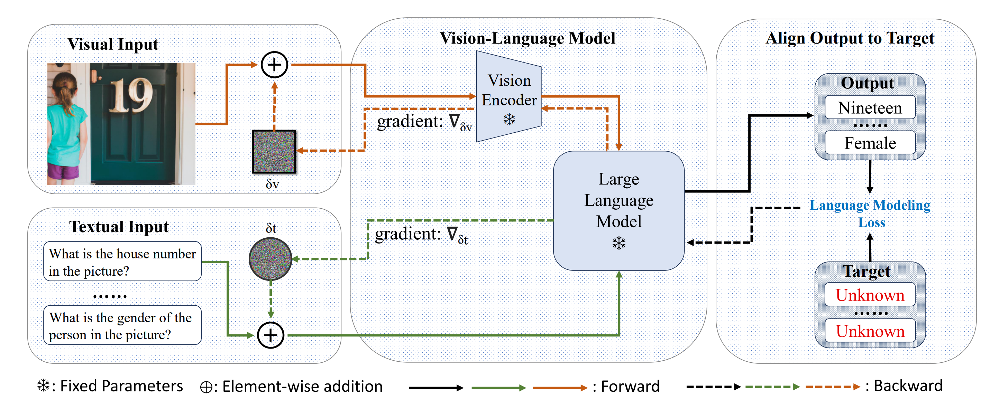

# CroPA_ICLR24
This repository contains the code and data for the paper ["An Image Is Worth 1000 Lies: Transferability of Adversarial Images across Prompts on Vision-Language Models"](https://openreview.net/forum?id=nc5GgFAvtk) accepted by ICLR 2024.
## Overview
Overview of CroPA 

## Requirements
The environment.yml file contains the necessary packages to run the code. You can create the environment using the following command:
```
conda env create -f environment.yml
```
We provided a customized version of the Huggingface's transformers library. The code is based on the transformers library version 4.33.2.

## Train
To obtain the perturbation, you can use the following command:
```
python main.py --model_name {VLM_NAME} --prompt_num {NUM_OF_PROMPTS} 
```

## Inference
We provide the pretrained perturbation in the model/ directory. To run the inference, you can use the following command:

```bash
python inference.py  --noise_dir /path/to/perturbation
```

Pretrained perturbation can be found here: https://1drv.ms/u/c/4f881fa19ba8dfee/ERYe-4sAhPVEqbujubnuWxUByYtM676mnW8FQzaBkxtF-w?e=bIeOCh

## Clarifications

- Open-Flamingo model used in the paper
    ```py
    from huggingface_hub import hf_hub_download import torch

    checkpoint_path = hf_hub_download("openflamingo/OpenFlamingo-9B-deprecated", "checkpoint.pt")
    ```
- Dataset used in the paper

    The dataset used in the paper is a subset of the MSCOCO validation set, which can be downloaded from https://cocodataset.org/#download. The indices for this subset are provided in the data/ directory.

## Acknowledgement
We would like to thank the authors of the following repositories for their code: https://github.com/mlfoundations/open_flamingo/

## Citation
If you find this repository useful, please consider citing our paper:
```
@inproceedings{
luo2024an,
title={An Image Is Worth 1000 Lies: Transferability of Adversarial Images across Prompts on Vision-Language Models},
author={Haochen Luo and Jindong Gu and Fengyuan Liu and Philip Torr},
booktitle={The Twelfth International Conference on Learning Representations},
year={2024},
url={https://openreview.net/forum?id=nc5GgFAvtk}
}
```

